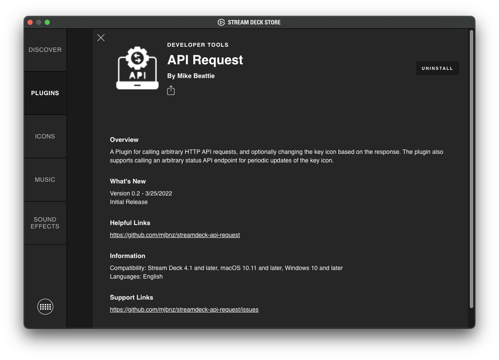
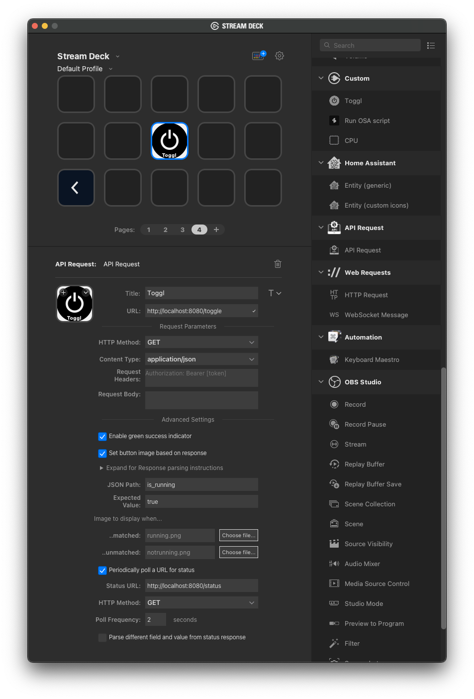

# Toggl-Cli-API

[](https://github.com/MaxWinterstein/toggl-cli-api/actions/workflows/docker-publish.yml)

Simply fastapi based wrap around [toggl-cli](https://github.com/AuHau/toggl-cli) to be used e.g. as docker container.

More designed like an RPC than API, but 🤷🏻‍♂️ .

## Why

This was mostly made to be used with an [elgato Stream Deck](https://www.elgato.com/en/stream-deck).  
There are some plugins available for toggl, but none provided me a simple _"Just continue the last thing I did"_ button.

## Run `toggl-cli-api`

There are multiple ways to use this little thing.  
I just run it as a docker container, e.g. on my synology. 

All needed is your toggl API token, see below, and make it available as environment variable `TOGGL_TOKEN`.

### Run as docker

```bash
docker run --rm -ti -e TOGGL_TOKEN=123abcddef -p 8080:80 ghcr.io/maxwinterstein/toggl-cli-api:main
```

## Use with Elgato Strem Deck

First you need to install the [API Request](https://github.com/mjbnz/streamdeck-api-request) plugin by [@mjbnz](https://github.com/mjbnz):  


Configuration is done like this:  


Adjust IP/hostname/port to your needs. 

### Get yout toggl token
See https://support.toggl.com/en/articles/3116844-where-is-my-api-key-located

## Restrictions

For the moment its main purpose it to `continue` and `stop` the last running entry.  
More features might be coming later. 

Also the icons could be nicer. Not sure, but I hope they are open source 🤞.
